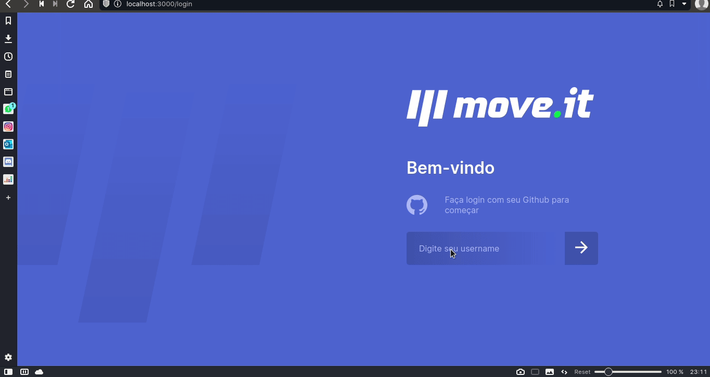

<h1 align="center">🏆 Move.It Next</h1>
<p align="center"> Projeto da imersão #NLW04 com React da RocketSeat </p>

</br>



</br>

## 💡 What is it?
A Aplicação desenvolvida é um cronômetro para utilizar  a técnica <a href="https://www.google.com/search?kgmid=/m/0b6gcp8&hl=pt-BR&q=T%C3%A9cnica+pomodoro&kgs=7eb54a9a0a36e478&shndl=0&source=sh/x/kp&entrypoint=sh/x/kp">POMODORO </a>
para o final de cada ciclo o usuário receba um desafio de um exercício. Pensando em ajudar a diminuir as chances de uma lesão ou uma doença futura por falta de se movimentar.
Projeto desenvolvido duruante o evento NLW#04 - Trilha de React da <a href="https://rocketseat.com.br"> RocketSeat </a> crianda essa aplicação web.

## 🚀 Technologies
Este projeto foi desenvolvido utilizando as seguintes tecnologias:
- [Next.js](https://nextjs.org/)
- [React](https://reactjs.org)
- [TypeScript](https://www.typescriptlang.org/)

## 🚀 Getting started
Clone the project and access the folder
```bash
$ git clone https://github.com/IcaroLettieri/moveit-next.git && cd moveit-next
```

## 🖥 Setup
- Run `yarn` to install dependecies
- Run `yarn dev` to run the project

## 🚧 Built With
- NextJS
- TypeScript
